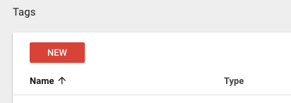
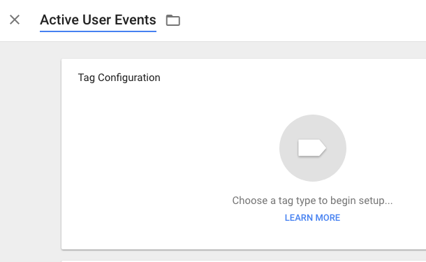
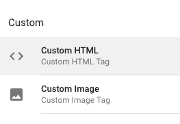
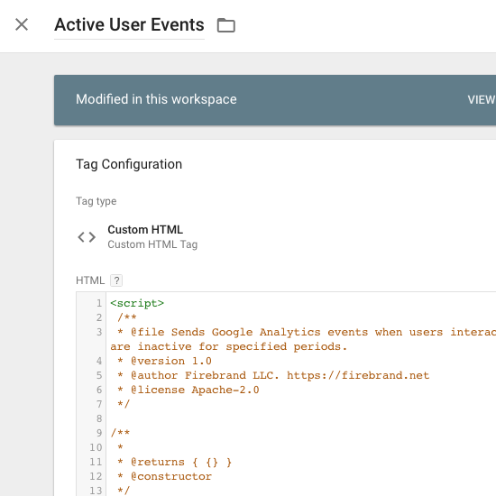
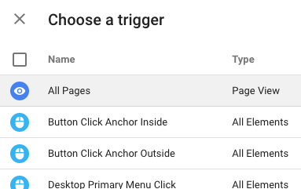
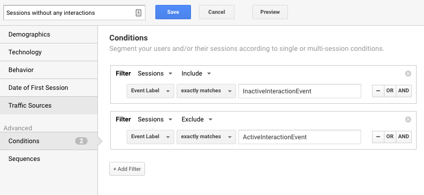

Tracking User Interactions for Impersonator Bot Detection
===========================
Motivation
----------
Google Analytics reports are polluted with a lot of "Direct" traffic that doesn't appear to correlate with other visitor information.

This script implements a method to discriminate between users interacting with an app or web page and bots just accessing a page.

Installation
------------
This script was designed to generate a custom segment for [Google Analytics](https://analytics.google.com/). And is implemented using [Google Tag Manager](https://www.google.com/analytics/tag-manager/)

### Add the script tag to Google Tag manager
If you haven't already set up Google Tag Manager (GTM), Google has some [helpful instructions](https://support.google.com/tagmanager/answer/6102821?hl=en).
1. From the Tags tab, create a new tag

2. Name it "Active User Events"

3. Set the type to Custom HTML

4. Paste the contents of user-interaction.js into the HTML edit box

5. Set the trigger to All Pages

1. Then save your tag

:hamster:

### Set up a Google Analytics custom dimension

Screenshots
-----------
Features
----------

License
-------
Apache V2(http://www.apache.org/licenses/)
